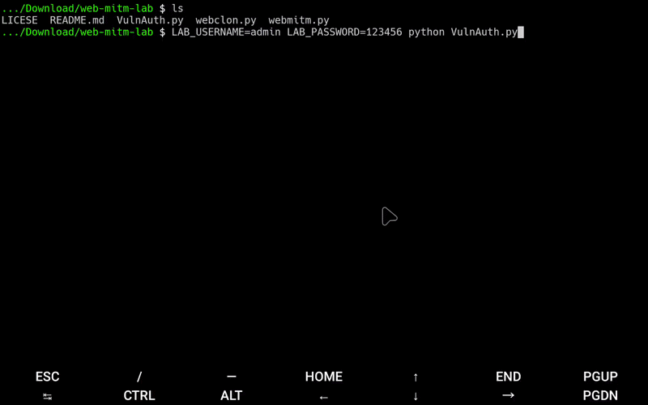

# WebMITM Lab - Framework de Investigación de Seguridad

**Python 3.x** | **Licencia Educativa** | [Ver Licencia](LICESE)

⚠️ **Solo para Fines Educativos e Investigación de Seguridad Autorizada**


---

## 📌 Descripción

WebMITM Lab es un framework educativo diseñado para demostrar conceptos de ataques Man-in-the-Middle (MITM) en entrenamiento de ciberseguridad e investigación en entornos controlados.

### Propósito
Este toolkit ayuda a profesionales de seguridad, estudiantes e investigadores a comprender:
- Técnicas de interceptación de tráfico
- Análisis de flujos HTTP/HTTPS
- Identificación de configuraciones inseguras
- Medidas de seguridad defensiva

---

## 🎓 Casos de Uso Educativos

**Apropiado para:**
- ✅ Cursos universitarios de ciberseguridad
- ✅ Certificaciones profesionales de seguridad (CEH, OSCP, GPEN)
- ✅ Entrenamiento de concientización de seguridad corporativa
- ✅ Evaluaciones de penetración autorizadas
- ✅ Ejercicios de red team en entornos aislados
- ✅ Investigación académica de seguridad

---

## 🛠 Características

### webmitm.py - Proxy Transparente
- Demostración de interceptación de tráfico en tiempo real
- Capacidades de análisis de sesiones
- Captura de cookies y tokens para análisis educativo
- Gestión de sesiones multi-cliente

### webclon.py - Simulador de Clonación Web
- Replicación de sitios web para propósitos de entrenamiento
- Demostración de captura de datos de formularios
- Entrenamiento de concientización sobre robo de credenciales
- Educación sobre técnicas de phishing

---

## 📋 Requisitos

- Python 3.x
- Dependencias necesarias (se instalan automáticamente)

---

## 🚀 Instalación

```bash
git clone https://github.com/dereeqw/web-mitm-lab.git
cd web-mitm-lab
python3 webmitm.py
